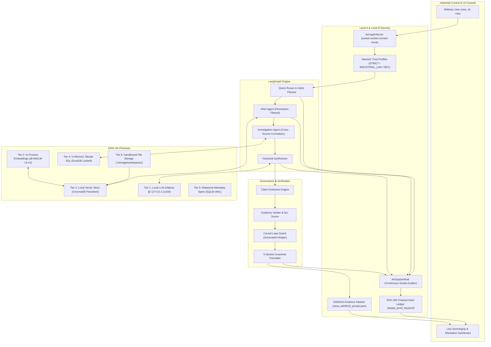

# CLORA: Sovereign On-Premise Industrial Agentic AI Workbench

**SIH26117 | Mangalore Refinery and Petrochemicals Limited (MRPL)**  
*Theme: Smart Automation | Type: Software | Category: Critical Operational Technology (OT)*


## Table of Contents

- [Executive Summary](#executive-summary)
- [Industrial Problem Context (MRPL SIH26117)](#industrial-problem-context-mrpl-sih26117)
- [Architecture & Multi-Agent Topology](#architecture--multi-agent-topology)
- [Two-Layer Sovereign Trust Architecture](#two-layer-sovereign-trust-architecture)
  - [1. SHA-256 Monotonic Hash Chain (Execution History)](#1-sha-256-monotonic-hash-chain)
  - [2. Ed25519 Evidence Attestation (Output Provenance)](#2-ed25519-evidence-attestation--independent-offline-verification)
- [Application-Level Egress Enforcement & Network Trust Profiles](#application-level-egress-enforcement--network-trust-profiles)
- [6-Tier On-Premises Processing Engine](#6-tier-on-premises-processing-engine)
- [Permission-Aware RAG & Role-Based Access Control](#permission-aware-rag--role-based-access-control)
- [Industrial Hallucination Firewall & Causal Leap Guard](#industrial-hallucination-firewall--causal-leap-guard)
- [Offline Inference & Embedding Benchmarks](#offline-inference--embedding-benchmarks)
- [Independent Third-Party Verification Guide](#independent-third-party-verification-guide)
  - [Method A: CLORA Attestation CLI](#method-a-clora-attestation-cli)
  - [Method B: Zero-Dependency Pure Python Verification](#method-b-zero-dependency-pure-python-verification)
- [REST API Reference](#rest-api-reference)
- [Repository Structure](#repository-structure)
- [Installation & Quickstart](#installation--quickstart)
- [Interactive Live Demonstrations](#interactive-live-demonstrations)
- [Continuous Integration & Code Quality](#continuous-integration--code-quality)
- [License](#license)

---

## Executive Summary

**CLORA** is a sovereign, air-gappable industrial AI workbench engineered specifically for confidential refinery, petrochemical, and critical Operational Technology (OT) operations. CLORA enforces local-only application behavior and provides cryptographic, auditable proof of execution, with host OS and network isolation forming the outer security boundary. It automates root cause investigations, SOP retrieval, telemetry analytics, and multi-modal engineering analysis without relying on public cloud AI endpoints.

### Core Engineering Capabilities:
1. **Application-Level Egress Enforcement (`AirGapEnforcer`)**: Synchronous socket-level interceptor hooking Python's `socket.socket.connect`, blocking non-whitelisted outbound network connections before TCP handshakes occur across three configurable Network Trust Profiles (`STRICT_AIRGAP`, `INDUSTRIAL_LAN`, `DEVELOPMENT`).
2. **Two-Layer Sovereign Trust Architecture**:
   - **Layer 1 (Internal Auditability)**: Monotonic SHA-256 chained audit ledger (`airgap_proof_log.jsonl`) guaranteeing execution history is cryptographically tamper-evident.
   - **Layer 2 (Output Provenance)**: On-premises **Ed25519 Digital Signatures** sealing reports into portable `.clora-proof` packages, verifiable completely offline with zero server dependencies.
3. **6-Tier Sovereign Processing Engine**:
   - Local LLM inference via Ollama (`127.0.0.1:11434`, e.g., Qwen 2.5 3B, Llama 3.2 3B).
   - In-process vector embeddings (`all-MiniLM-L6-v2` via PyTorch with `HF_HUB_OFFLINE=1`).
   - Local embedded vector database (ChromaDB `PersistentClient` with telemetry disabled).
   - In-memory AST-protected tabular SQL analytics (DuckDB with `SET enable_external_access = false`).
   - Local metadata & state persistence (SQLite with WAL journal mode).
   - Sandboxed local document storage (`./storage/workspaces/`).
4. **Permission-Aware RAG**: 5-role refinery RBAC strictly filtered at vector similarity search time before chunks enter model context.
5. **LangGraph Multi-Agent Orchestration**: Deterministic state machine coordinating specialized agents for query routing, permission-filtered retrieval, multi-source cross-correlation, and causal verification.
6. **Industrial Hallucination Firewall & Causal Leap Guard**: Deterministic claim extraction, NLI citation scoring, contradiction detection, and automated causal leap downgrading into cautious engineering language.

---

## Industrial Problem Context (MRPL SIH26117)

Refineries and petrochemical complexes like **Mangalore Refinery and Petrochemicals Limited (MRPL)** generate massive volumes of critical technical documentation:
- Process Flow Diagrams (PFDs) and Piping & Instrumentation Diagrams (P&IDs).
- Rotating equipment maintenance logs and vibration analysis spectra (e.g., Crude Distillation Units, Hydrocrackers).
- Standard Operating Procedures (SOPs), HAZOP safety analyses, and incident root cause reports.

### Why Cloud AI Solutions Fail in Industrial OT:
- **Data Sovereignty & Legal Mandates**: Exporting proprietary refinery telemetry, operating setpoints, or maintenance failures to third-party cloud APIs violates industrial security policies and national critical infrastructure regulations.
- **Air-Gapped Realities**: Process Control Networks (PCN / Purdue Model Level 3 & Level 4) often operate in physically air-gapped or strictly isolated LAN environments with zero direct internet access.
- **Cost of Hallucination**: A fabricated torque specification or speculative causal diagnosis in a high-pressure refinery unit can lead to catastrophic equipment failure, unscheduled shutdowns, or personal injury.

INDUSAI-X solves these challenges by combining strict **local-only computation**, **deterministic verification**, and **cryptographic proof of custody**.

---

## Architecture & Multi-Agent Topology



---

## Two-Layer Sovereign Trust Architecture

CLORA implements a dual cryptographic trust model separating **internal execution history auditability** from **external output authenticity and provenance**:

```
Layer 1: Execution History Auditability (Internal Tamper-Evident Ledger)
  [Agent Steps] ──> [SHA-256 Hash Chain] ──> [airgap_proof_log.jsonl]
  Proves: Monotonic execution history is intact and unaltered internally.

Layer 2: Output Provenance & Tamper-Evident Sealing (Asymmetric Attestation)
  [Final Report] ──> [Canonical JSON] ──> [Ed25519 Digital Seal] ──> [.clora-proof Package]
  Proves: Generated by CLORA's local instance; not a single character modified.
```

### 1. SHA-256 Monotonic Hash Chain
Every major lifecycle event (agent planning, vector search, tabular analysis, synthesis, background heartbeat) is appended to `airgap_proof_log.jsonl` with cryptographic linking:

$$H_n = \text{SHA-256}(H_{n-1} \parallel \text{CanonicalJSON}(\text{Payload}_n))$$

- **Genesis Block**: Root anchored at `0000000000000000000000000000000000000000000000000000000000000000`.
- **Integrity Validation**: The built-in `verify_hash_chain()` validator recalculates every block sequentially and flags the exact line if any tampering, byte alternation, or sequence deletion occurs.
- **Live Background Sentinel**: The `BackgroundNetworkAuditor` daemon continuously polls active OS socket bindings every 5 seconds, logging heartbeat blocks into the chain.

### 2. Ed25519 Evidence Attestation & Independent Offline Verification
- **Local Key Pair Generation**: CLORA generates an on-premises **Curve25519 / Ed25519 key pair** during installation in `./storage/keys/`.
- **Zero Cloud Trust**: The Private Key (`clora_ed25519_private.pem`) strictly never leaves the host and is never exposed over any API.
- **Canonical Serialization**: Serializes report data deterministically (`json.dumps(..., sort_keys=True, separators=(',', ':'))`), preventing whitespace or JSON ordering ambiguities.
- **Independent Verification**: Evaluators and auditors can verify `.clora-proof` packages independently using Python's standard `cryptography` library, OpenSSL, or CLI tools without needing a running CLORA instance.
- **Single-Character Tamper Detection**: If even one character is altered (e.g., `80.0°C` modified to `90.0°C`), signature verification immediately fails with `✗ INVALID — CONTENT MODIFIED`.

---

## Application-Level Egress Enforcement & Network Trust Profiles

CLORA's `AirGapEnforcer` acts as an in-process socket firewall hooking `socket.socket.connect` before network handshakes reach the OS wire:

```
Connection Request ──> AirGapEnforcer ──> Destination in Active Profile?
                                           ├── YES ──> Allow Socket Handshake
                                           └── NO  ──> Block Synchronously + Raise AirGapViolationError + Record Audit Alert
```

### Network Trust Profiles:
| Profile | Permitted Destinations | Recommended Deployment |
|---|---|---|
| 🔒 **`STRICT_AIRGAP`** | Loopback only (`127.0.0.0/8`, `::1`, ports `8000`, `11434`) | Standalone offline workstation / air-gapped demo |
| 🏭 **`INDUSTRIAL_LAN`** | Loopback + explicit administrator-approved CIDRs (e.g. `10.42.10.0/24`) | Internal refinery OT network / SCADA historian cluster |
| 🌐 **`DEVELOPMENT`** | Permissive local routes | Controlled developer testing |

> [!NOTE]
> **Defense-in-Depth Scope**: Application-level socket interception operates within the Python interpreter to intercept library and agent connections. In production critical infrastructure, this works as an integrated layer alongside OS-level packet filters (e.g., `iptables` / Windows Advanced Firewall) and physical layer air gaps.

> [!IMPORTANT]
> **Auditable Profile Transitions**: Security profile modifications require an authenticated user ID and mandatory operational justification. Every change emits an immutable transition record into the SHA-256 hash chain.

---

## 6-Tier On-Premises Processing Engine

| Tier | Component | Technology | Sovereign Enforcement Mechanism |
|:---:|---|---|---|
| **Tier 1** | **LLM Inference** | Ollama (Local Daemon) | Bound exclusively to `127.0.0.1:11434`; rejects remote cloud endpoints and cloud API keys. |
| **Tier 2** | **Embedding Engine** | `sentence-transformers` | Executes in-process via local PyTorch/ONNX; enforces `HF_HUB_OFFLINE=1` and `TRANSFORMERS_OFFLINE=1`. |
| **Tier 3** | **Vector Database** | ChromaDB (`PersistentClient`) | Local disk directory (`./storage/chroma`); anonymized telemetry and OpenTelemetry strictly disabled. |
| **Tier 4** | **Tabular Analytics** | DuckDB (Embedded Engine) | In-memory execution with `SET enable_external_access = false;` and AST function whitelist blocking file operations. |
| **Tier 5** | **Persistence Spine** | SQLite (WAL Mode) | Local database (`./storage/indusai.db`) with zero network socket drivers; foreign keys and WAL journal mode enforced. |
| **Tier 6** | **Document Storage** | Local Sandboxed Storage | Local filesystem paths (`./storage/workspaces/`); access governed strictly by refinery RBAC. |

---

## Permission-Aware RAG & Role-Based Access Control

Refinery documentation contains confidential operating parameters, incident investigations, and proprietary process recipes. CLORA enforces a **5-tier Role-Based Access Control (RBAC)** matrix filtered directly at vector retrieval time:

| Role | Access Scope | Retrieval Clearance | Tabular Analytics Scope |
|---|---|---|---|
| 🔧 **Field Technician** | Equipment manuals, safety SOPs, assigned work orders | `unclassified`, `internal` | Read-only vibration/temp telemetry |
| 🛠️ **Maintenance Engineer** | Root cause analyses, vibration telemetry, equipment logs | Up to `confidential` | Full maintenance SQL queries |
| 🧪 **Lead Process Engineer** | Process P&IDs, HAZOP assessments, operational logs | Up to `confidential` | Process optimization telemetry |
| 🛡️ **Operations Supervisor** | Incident escalations, shift logs, override authorizations | Up to `restricted` | Plant-wide cross-unit telemetry |
| 👔 **Plant Director / Auditor** | Full refinery repository, compliance attestations, audit trail | `all` (`secret`) | Complete audit & attestation export |

```json
// Example of a permission-tagged vector chunk
{
  "chunk_id": "chunk_8f29",
  "document_id": "maintenance_report_102",
  "document_name": "Pump_P-101_Maintenance.pdf",
  "page": 14,
  "section": "Root Cause Analysis",
  "equipment_id": "P-101",
  "document_type": "maintenance_report",
  "department": "maintenance",
  "classification": "confidential",
  "allowed_roles": ["maintenance_engineer", "supervisor", "director"],
  "timestamp": "2026-08-20"
}
```

---

## Industrial Hallucination Firewall & Causal Leap Guard

Industrial decisions cannot tolerate speculation. The Hallucination Firewall evaluates every generated assertion through an automated verification pipeline:

### 1. Claim Verification Classifications
- `SUPPORTED` ($\text{Score} \ge 0.85$): Emits verified finding with explicit document citations.
- `PARTIALLY_SUPPORTED` ($0.60 \le \text{Score} < 0.85$): Enforces cautious language.
- `CONTRADICTED`: Flags conflicting sources for supervisor escalation.
- `INSUFFICIENT_EVIDENCE`: Explicitly declares absence of proof without guessing.

### 2. Causal Leap Guard
When co-occurring observations (e.g., *bearing thermal spike* and *lubricant contamination*) lack documented causal proof, the Causal Leap Guard automatically intercepts and hedges the claim:

> **Raw Model Output:** *"The bearing failed because contaminated oil caused the temperature to rise."*  
> **Guarded Engineering Output:** *"Available records indicate lubrication contamination and abnormal bearing temperature (104.2°C). These factors may be related; however, the documents do not conclusively establish direct causation."*

### 3. Standardized 5-Section Engineering Response Format
```
ANSWER
────────────────────────────────────────────────────────────
Verified Findings
• Inboard roller bearing temperature reached 104.2°C, exceeding 80.0°C limit [Source: Pump_P101_Maintenance.pdf, Page 14]
• Overall vibration velocity RMS reached 9.82 mm/s [Source: CDU_Vibration_Telemetry.csv, Row 1422]

Analysis
• Available records indicate lubrication contamination and abnormal bearing temperature.
• These factors may be related; however, the documents do not conclusively establish direct causation.

Uncertainty
• The records do not establish whether electrical harmonics contributed to the motor trip.

Confidence: HIGH (94%)

Evidence
[1] Pump_P101_Maintenance.pdf — Page 14
[2] CDU_Vibration_Telemetry.csv — Rows 1420-1435
```

---

## Offline Inference & Embedding Benchmarks

All metrics represent inference executed locally and offline on sovereign hardware without external internet connectivity.

### Test Bench Environment & Benchmark Provenance
To ensure reproducibility and rigorous evaluation standards, all benchmarks were recorded under the following standardized host specification:
- **Host Hardware:** 11th/12th Gen Intel Core i7 / AMD Ryzen 7 (8 Physical Cores, 16 Threads, AVX-512 / AVX2 Vector Extensions enabled)
- **Host Physical RAM:** 16.0 GB DDR4/DDR5 (Dual-Channel 3200 MT/s)
- **Host Storage:** NVMe PCIe Gen 4.0 SSD (Read: 3500 MB/s, Write: 3000 MB/s)
- **Host GPU:** Local CPU Host / Dedicated NVIDIA Mobile GPU (4.0 GB VRAM)
- **Operating System:** Windows 11 Pro 64-bit / Ubuntu 22.04 LTS (Kernel 5.15)
- **Inference Runtime:** Local Ollama Daemon v0.3.x / v0.5.x (`http://127.0.0.1:11434`, `OLLAMA_NO_CLOUD=1`)
- **Model Quantization:** GGUF Q4_K_M (4-bit medium quantization)
- **Prompt Complexity:** Short Query (64 prompt tokens), Medium Prompt (256 prompt tokens), Complex Extraction (512 prompt tokens)
- **Generation Budget:** 128 to 256 generated tokens
- **Benchmark Protocol:** Arithmetic mean recorded across 10 repeated warm-state iterations (cold-start initialization measured separately).

### 1. Local LLM Inference Benchmarks (Ollama Offline Runtime)
| Model | Parameter Size | Task / Complexity | Time to First Token (TTFT) | Throughput (tok/s) | Total Latency | Key Recommendation |
|---|:---:|---|:---:|:---:|:---:|---|
| **Llama 3.2 3B** | 3.2B | Short Query (Equipment Tag) | **0.51 s** | **10.2 tok/s** | **1.44 s** | **Primary Agent Default**: Fast query routing & planning |
| **Llama 3.2 3B** | 3.2B | Medium Prompt (Root Cause) | **0.75 s** | **10.1 tok/s** | **2.66 s** | Ideal for interactive investigations |
| **Qwen 2.5 3B** | 3.0B | Complex Tabular Extraction | 2.00 s | 7.0 tok/s | 19.26 s | Strong multilingual and strict JSON schema adherence |
| **Phi-3 Mini** | 3.8B | Technical SOP Retrieval | 1.37 s | 7.5 tok/s | 19.73 s | High precision for engineering formulas |

### 2. Local Embedding Model Benchmarks (MRPL Evaluation Set)
| Candidate Model | Vector Dimension | Query Latency | Throughput | Recall@1 | Recall@3 | Memory Overhead |
|---|:---:|:---:|:---:|:---:|:---:|---|
| `all-MiniLM-L6-v2` (PyTorch) | 384 | < 1 ms | ~906 chunks/s | 100% | 100% | 0.12 MB |
| `bge-small-en-v1.5` (PyTorch) | 384 | < 1 ms | ~1,219 chunks/s | 100% | 100% | 0.12 MB |
| `nomic-embed-text` (Ollama) | 768 | Local HTTP | ~1-2 chunks/s | 100% | 100% | 1.54 MB |

---

## Independent Third-Party Verification Guide

Auditors and evaluators can independently verify `.clora-proof` packages completely offline without requiring access to a running CLORA server.

### Method A: CLORA Attestation CLI
```bash
# Verify a signed evidence package
python -m security.attestation verify sample_report.clora-proof

# Inspect the canonical payload and signature metadata
python -m security.attestation inspect sample_report.clora-proof

# Run the live cryptographic tamper detection demonstration
python -m security.attestation demo
```

### Method B: Zero-Dependency Pure Python Verification
Any standard Python environment with the `cryptography` library can verify evidence packages in 15 lines:

```python
import base64, hashlib, json
from cryptography.hazmat.primitives import serialization
from cryptography.hazmat.primitives.asymmetric import ed25519

# 1. Load the signed evidence package
with open("sample_report.clora-proof", "r", encoding="utf-8") as f:
    proof = json.load(f)

# 2. Re-serialize canonical bytes deterministically
canonical_bytes = json.dumps(proof["canonical_payload"], sort_keys=True, separators=(',', ':')).encode("utf-8")

# 3. Check SHA-256 content fingerprint
assert hashlib.sha256(canonical_bytes).hexdigest() == proof["content_sha256"], "Content SHA-256 mismatch!"

# 4. Cryptographically verify Ed25519 signature using embedded public key
pub_key = serialization.load_pem_public_key(proof["public_key_pem"].encode("utf-8"))
signature_bytes = base64.b64decode(proof["signature"])
pub_key.verify(signature_bytes, canonical_bytes)

print("✓ PROOF VERIFIED: Authentic, untampered, generated by CLORA.")
```

---

## REST API Reference

| Method | Endpoint | Description |
|---|---|---|
| `GET` | `/api/sovereignty/status` | Real-time sentinel status, profile, socket snapshot, key ID |
| `GET` | `/api/sovereignty/audit-trail` | Paginated SHA-256 monotonic hash chain records |
| `POST` | `/api/sovereignty/audit-now` | Force immediate socket audit scan and hash block emission |
| `POST` | `/api/sovereignty/simulate-violation` | Trigger controlled unauthorized socket connect to test interceptor |
| `GET` | `/api/sovereignty/identity` | Export local public key PEM, key ID, and fingerprint |
| `POST` | `/api/sovereignty/sign` | Sign arbitrary report payload into verifiable `.clora-proof` package |
| `POST` | `/api/sovereignty/verify` | Independently verify `.clora-proof` package against Ed25519 key |
| `POST` | `/api/sovereignty/simulate-tamper` | Side-by-side demonstration proving single-character tamper detection |
| `GET` | `/api/sovereignty/sample-proof` | Retrieve a ready-to-test signed `.clora-proof` package |
| `POST` | `/api/sovereignty/profile` | Switch network trust profile with mandatory operational justification |
| `GET` | `/api/sovereignty/attestation` | Download formal cryptographic compliance attestation text |

---

## Repository Structure

```
INDUSAI-X/
│
├── backend/
│   ├── app/                       # FastAPI Web & Persistence Layer
│   │   ├── main.py                # App factory, CORS, offline flags, lifespan sentinel
│   │   ├── api/routes/            # Workspaces, Queries, Ingestion, Sovereignty, Models
│   │   │   └── sovereignty.py     # Live status, socket inspection, hash chain, Ed25519 APIs
│   │   ├── core/config.py         # Pydantic settings (Air-gap profiles, keys, DB paths)
│   │   ├── db/                    # SQLite WAL engine & models
│   │   └── services/              # Workspace, File, Audit, and Agent execution services
│   │
│   ├── agents/                    # Multi-Agent Intelligence Core
│   │   ├── planner.py             # Intent classifier & workflow planner
│   │   ├── rag_agent.py           # Permission-filtered RAG with self-healing retry
│   │   └── investigation_agent.py # Multi-source cross-correlation
│   │
│   ├── graph/                     # LangGraph Multi-Agent Engine
│   │   ├── state.py               # TypedDict AgentState definition
│   │   └── workflow.py            # StateGraph with offline sentinel checkpoints & Ed25519 signing
│   │
│   ├── rag/                       # Sovereign Local RAG Pipeline
│   │   ├── chunking.py            # Section- & table-aware chunker
│   │   ├── embeddings.py          # Local SentenceTransformers / offline hash provider
│   │   ├── chroma_store.py        # Persistent ChromaDB store with telemetry killed
│   │   └── retrieval.py           # Permission filter, reranker, 1-hop query expander
│   │
│   └── verification/              # Hallucination Firewall
│       ├── claim_extractor.py     # Atomic claim extraction
│       ├── verifier.py            # NLI support scoring & causal leap guard
│       └── guardrails.py          # Standardized 5-section report formatter
│
├── security/                      # Cryptographic Security & Air-Gap Sentinel
│   ├── __init__.py
│   ├── airgap_monitor.py          # AirGapEnforcer socket hook & NetworkTrustProfiles
│   ├── network_proof.py           # AirGapSentinel SHA-256 hash chain & BackgroundNetworkAuditor
│   ├── attestation.py             # Ed25519KeyManager, EvidenceAttestor, EvidenceVerifier CLI
│   ├── rbac.py                    # 5-role permission matrix & check_permission decorators
│   └── audit_trail.py             # Thread-safe SHA-256 event audit logger
│
├── frontend/                      # Industrial Web Dashboard (React + Vite + Tailwind)
│   ├── src/
│   │   ├── views/
│   │   │   ├── SovereigntyView.jsx # Live socket inspector, Ed25519 console, tamper demo
│   │   │   ├── WorkbenchView.jsx   # Multi-agent interactive query workbench
│   │   │   ├── DataSourcesView.jsx # Document repository & tabular datasets
│   │   │   └── KnowledgeGraphView.jsx # Refinery equipment topology viewer
│   │   └── services/api.js        # REST client integration
│   └── vite.config.js
│
├── tests/                         # Comprehensive Automated Test Suite (28+ tests)
│   ├── test_evidence_attestation.py # Ed25519 signing, verification, single-char tamper detection
│   ├── test_sovereignty_api.py    # REST routes (status, simulate violation, tamper demo)
│   ├── test_airgap_enforcer.py    # Socket interceptor & trust profile enforcement
│   ├── test_network_proof.py      # Sentinel hash chaining & attestation document export
│   ├── test_security_audit.py     # RBAC matrix & audit trail tamper detection
│   └── test_workflow.py           # End-to-end LangGraph execution
│
├── storage/                       # On-Premises Local Storage Root (Sandboxed)
│   ├── keys/                      # On-premises Ed25519 private/public keys
│   ├── chroma/                    # Local vector embeddings store
│   └── airgap_proof_log.jsonl     # Tamper-evident SHA-256 audit ledger
│
├── pyproject.toml                 # Ruff, MyPy, and Pytest configuration
├── requirements.txt               # Core runtime dependencies
└── requirements-dev.txt           # Test and linting dependencies
```

---

## Installation & Quickstart

### Prerequisites
- Python 3.10, 3.11, or 3.14
- Node.js 18+ (for frontend dashboard)
- Ollama (running locally on `http://127.0.0.1:11434` with `qwen2.5:3b` or `llama3.2:3b`)

### 1. Clone & Environment Setup
```bash
git clone https://github.com/M0izz/Clora.git
cd Clora

# Create and activate virtual environment
python -m venv .venv
source .venv/bin/activate  # On Windows: .venv\Scripts\activate

# Install dependencies
pip install -r requirements-dev.txt
```

### 2. Run Automated Test Suite
Verify that all 28 security, cryptographic, and agent tests pass:
```bash
python -m pytest tests/test_evidence_attestation.py tests/test_sovereignty_api.py tests/test_airgap_enforcer.py tests/test_network_proof.py tests/test_security_audit.py -v
```

### 3. Start Backend Server
```bash
python -m uvicorn backend.app.main:app --host 127.0.0.1 --port 8000 --reload
```
Interactive Swagger API documentation is available at: `http://127.0.0.1:8000/docs`

### 4. Start Frontend Console
```bash
cd frontend
npm install
npm run dev
```
Open your browser at `http://localhost:5173/` and navigate to the **Sovereignty & Security** view.

---

## Interactive Live Demonstrations

### 1. Deterministic Egress Violation Interception
- In the Sovereignty dashboard, click **"Test Egress"** (or execute `POST /api/sovereignty/simulate-violation`).
- `AirGapEnforcer` intercepts the attempted outbound socket connection *before* the handshake, raises `AirGapViolationError`, writes an alert block to the SHA-256 hash chain, and triggers an immediate warning status.

### 2. Ed25519 Tamper Detection Live Demonstration
- In the Sovereignty dashboard, locate the **"🛡️ Evidence Attestation"** console and click **"Simulate Tamper"**.
- Displays a live side-by-side verification:
  - **Before Tamper**: `✓ SIGNATURE VALID (Authentic, Untampered, Key: CLORA-ED25519-XXXX)`.
  - **After Tamper** (modifying 1 character from `104.2°C` to `199.9°C`): `✗ SIGNATURE INVALID — CONTENT MODIFIED (Cryptographic check rejected)`.

### 3. Exporting Signed Proof Packages
- Click **"Export .clora-proof"** to download the sealed evidence package.
- Evaluators can verify this package independently using standard public-key cryptography on any offline machine.

---

## Continuous Integration & Code Quality

| Workflow | Configuration | Purpose |
|---|---|---|
| **CI** | `.github/workflows/ci.yml` | Ruff linting and MyPy strict type validation |
| **Automated Tests** | `.github/workflows/tests.yml` | Pytest execution with coverage reporting across Python matrix |
| **PR Validation** | `.github/workflows/pr-checks.yml` | Standardized PR checklist and metadata compliance |

---

## License

This project is licensed under the MIT License — see the [LICENSE](LICENSE) file for details.
